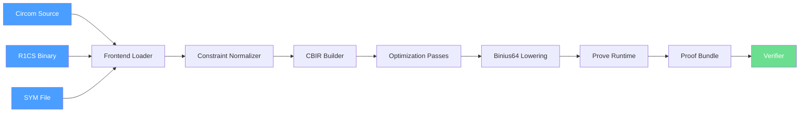

# CirBinius

CirBinius is an open-source compiler that translates Circom circuits and R1CS artifacts into Binius64-compatible proof circuits.

It allows ZK developers to reuse existing Circom circuits while experimenting with Binius-style binary proof systems. Deterministic artifact contracts, schema-versioned JSON, and SHA-256 content hashing ensure pipeline integrity from source to proof bundle.

---

## Architecture

```
┌─────────────────────────────────────────────────────────────────┐
│                        CLI (cirbinius)                          │
│   compile | compile-r1cs | analyze | optimize | lower | prove   │
│   verify | check-witness | doctor | init | inspect | clean     │
└───────────────────────────┬─────────────────────────────────────┘
                            │
┌───────────────────────────▼─────────────────────────────────────┐
│                     cirbinius-core (dispatch)                    │
│    Orchestrates all pipeline stages, artifact integrity checks   │
└──────┬──────────┬──────────┬──────────┬──────────┬──────────────┘
       │          │          │          │          │
       ▼          ▼          ▼          ▼          ▼
┌──────────┐ ┌──────────┐ ┌──────────┐ ┌──────────┐ ┌──────────┐
│frontend  │ │ normalize│ │optimizer │ │ binius64 │ │ witness  │
│+ r1cs    │ │          │ │+ analyze │ │ lowering │ │ engine   │
│+ symbols │ │          │ │          │ │ backend  │ │          │
└──────────┘ └──────────┘ └──────────┘ └──────────┘ └──────────┘
       │          │          │          │          │
       └──────────┴──────────┴──────────┴──────────┘
                            │
                            ▼
┌─────────────────────────────────────────────────────────────────┐
│                    cirbinius-artifacts                           │
│  CBIR | ProvePrecheckBundle | ProofBundle | BackendCapabilities │
│  Schema-versioned JSON contracts with sealed SHA-256 hashes     │
└─────────────────────────────────────────────────────────────────┘
```

## Compiler Pipeline



## Pipeline Stages

| Stage | Crate | Description |
|-------|-------|-------------|
| 1. Frontend Loader | `cirbinius-frontend` | Loads `.r1cs` binary + optional `.sym` into a unified bundle |
| 2. R1CS Parser | `cirbinius-r1cs` | Binary `.r1cs` parser (wire count, constraints, A B C matrices) |
| 3. Symbol Resolver | `cirbinius-symbols` | `.sym` text parser mapping signal names to wire indices |
| 4. Constraint Normalizer | `cirbinius-normalize` | Canonicalizes constraint ordering and A-B-C hex values |
| 5. CBIR Builder | `cirbinius-cbir` | Emits CBIR document with deterministic SHA-256 content hash |
| 6. Optimization Passes | `cirbinius-optimizer` | Motif detection (boolean, bit, range, XOR, AND, MUX, Merkle, hash) |
| 7. Analyzer | `cirbinius-optimizer` | Pattern recognition + lowering rules index emission |
| 8. Binius64 Lowering | `cirbinius-binius64` | Classifies constraints into gate families (boolean, range_check, xor, etc.) |
| 9. Witness Engine | `cirbinius-witness` | `.wtns` parser, witness equivalence, constraint replay, snarkjs integration |
| 10. Artifact Contracts | `cirbinius-artifacts` | Schema-versioned JSON types with sealed SHA-256 hashes |

## CLI Reference

```
cirbinius init         Initialize project scaffold
cirbinius compile      Compile .circom source → CBIR
cirbinius compile-r1cs Compile .r1cs binary → CBIR
cirbinius analyze      Analyze circuit structure + emit lowering rules index
cirbinius optimize     Apply pattern-based optimization passes
cirbinius lower        Lower CBIR → Binius64 artifact
cirbinius prove        Prove precheck (witness gen + bundle emission)
cirbinius verify       Verify proof bundle integrity
cirbinius check-witness Check Circom ↔ Binius witness equivalence
cirbinius doctor       Emit backend capabilities manifest
cirbinius inspect      Inspect circuit metadata
cirbinius benchmark    Benchmark pipeline stages
cirbinius explain      Explain constraint structure
cirbinius clean        Clean build artifacts
```

## Quick Start

### 1. Compile from R1CS

```bash
# Load an existing .r1cs + .sym and emit CBIR
cargo run -- compile-r1cs --r1cs tests/circuits/simple_mul.r1cs \
  --sym tests/circuits/simple_mul.sym --out build/
```

### 2. Compile from Circom Source

```bash
# Requires circom binary installed
cargo run -- compile tests/circuits/simple_mul.circom --out build/
```

### 3. Analyze and Lower

```bash
cargo run -- analyze --r1cs tests/circuits/simple_mul.r1cs \
  --sym tests/circuits/simple_mul.sym --out build/analysis.json

cargo run -- lower --cbir build/circuit.cbir.json \
  --out build/binius64.json
```

### 4. Prove Precheck

```bash
cargo run -- prove --r1cs tests/circuits/simple_mul.r1cs \
  --sym tests/circuits/simple_mul.sym \
  --wasm build/circom/simple_mul.wasm \
  --input tests/circuits/simple_mul_input.json \
  --out build/ --precheck-only
```

### 5. Verify Bundle

```bash
cargo run -- verify --bundle build/proof_bundle.json
```

### 6. Doctor (Backend Capabilities)

```bash
cargo run -- doctor --out build/backend_capabilities.json
```

## Workspace Layout

```
cirbinius/
├── Cargo.toml              # Workspace manifest
├── crates/
│   ├── cirbinius-cli       # CLI binary (clap-based)
│   ├── cirbinius-core      # Command dispatch + pipeline orchestration
│   ├── cirbinius-frontend  # R1CS+SYM loader
│   ├── cirbinius-r1cs      # Binary .r1cs parser
│   ├── cirbinius-symbols   # .sym text parser
│   ├── cirbinius-normalize # Constraint canonicalization
│   ├── cirbinius-cbir      # CBIR IR builder + hash validation
│   ├── cirbinius-optimizer # Motif detection + optimization passes
│   ├── cirbinius-binius64  # Binius64 lowering backend
│   ├── cirbinius-witness   # Witness engine (.wtns, snarkjs, equivalence)
│   ├── cirbinius-artifacts # Artifact contracts (CBIR, bundles, manifests)
│   ├── cirbinius-prover    # Prover runtime scaffold
│   ├── cirbinius-verifier  # Verifier scaffold
│   ├── cirbinius-reports   # Report generation
│   ├── cirbinius-sandbox   # Sandbox/workflow environment
│   ├── cirbinius-api       # API server scaffold
│   ├── cirbinius-bench     # Benchmarking harness
│   └── cirbinius-types     # Shared types (Backend, CompileMode, etc.)
├── tests/
│   ├── circuits/           # Circuit fixtures (.r1cs, .sym, .wtns, .wasm)
│   ├── golden/             # Golden artifact files
│   ├── fuzz/               # Fuzz test harnesses
│   └── integration/        # Integration test helpers
├── examples/               # Example circuits
├── docs/
│   ├── contracts/          # Schema-versioned JSON contracts + docs
│   ├── architecture.md
│   ├── compiler-pipeline.md
│   ├── cli.md
│   ├── lowering-rules.md
│   ├── cbir-spec.md
│   ├── security.md
│   └── contributing.md
├── sdk/                    # Language SDKs (rust, python, typescript)
└── .github/
    └── workflows/ci.yml    # CI with schema guard, lint, test, artifact upload
```

## Deterministic Artifact Contracts

Every emitted artifact follows a versioned JSON schema and includes:

| Field | Description |
|-------|-------------|
| `schema_version` | Matches a `docs/contracts/*-vN.schema.json` |
| `toolchain_version` | Crate version that produced the artifact |
| `*_hash` | SHA-256 hash of the hash-stable payload |

Contracts are enforced in CI via `.github/schema_guard.py`.

## Status

This repository contains the production CirBinius compiler toolchain. All core phases are implemented as real vertical slices with integration tests:

- ✅ **Phase 1**: R1CS/SYM parsing → CBIR emission (deterministic, hash-validated)
- ✅ **Phase 2**: Circom source compilation → R1CS → CBIR (differential-tested)
- ✅ **Phase 3**: Witness engine (.wtns parsing, equivalence, constraint replay)
- ✅ **Phase 4**: Pattern recognition, optimization, lowering rules index
- ✅ **Phase 5**: Prove precheck + proof bundle integrity + verify
- ✅ **Phase 6**: Backend capabilities manifest + doctor + capability gating
- ✅ **CI**: Schema guard, formatting, clippy, 40+ tests, PR artifact upload

## License

MIT
